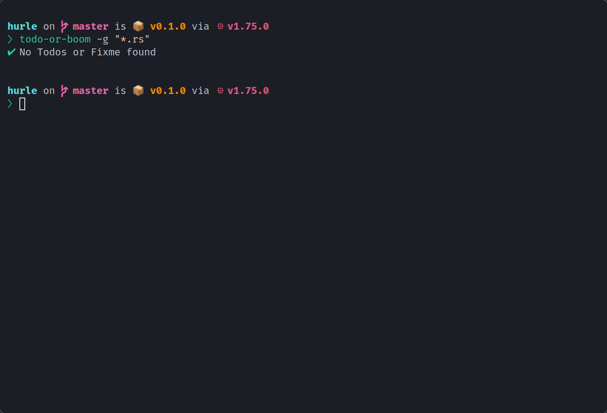
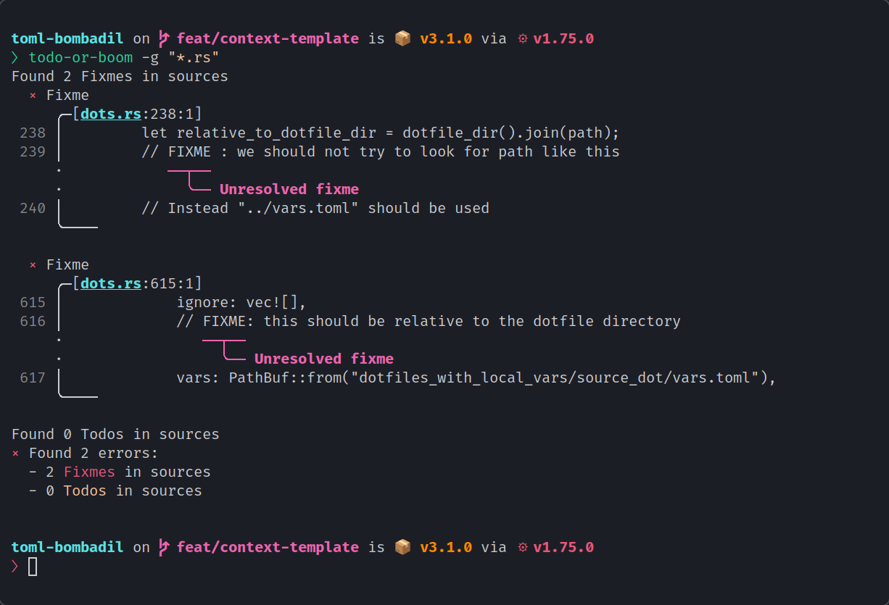

<p align="center">
  
</p>

<p align="center">
  <a href="https://github.com/oknozor/todo-or-boom/actions"
    ></a>
  <a href="https://codecov.io/gh/oknozor/todo-or-boom"
    ></a>
  <br />
  <a href="https://conventionalcommits.org"
    ></a>
  <a href="https://github.com/oknozor/todo-or-boom/blob/main/LICENSE"
    ></a>
</p>


<h1></h1>

ToB is todos and fixme linter. You most likely want to automate its usage using it either in a git commit hook 
or in your CI/CD pipeline. 


|  |  |
|-------------------------------------|-------------------------------------|


## Warning
⚠️ ToB is still a work in progress, currently only C-style comments are implemented, ToB will work with language like java, rust, c etc. ⚠️

## Usage

see: `todo-or-boom --help`

### Command line

```shell
todo-or-boom -g "*.rs"
todo-or-boom -g "*.java"
```

### Pre-commit git-hook

```shell
#!/bin/sh
set -e

todo-or-boom -g "**/*.rs"
```


